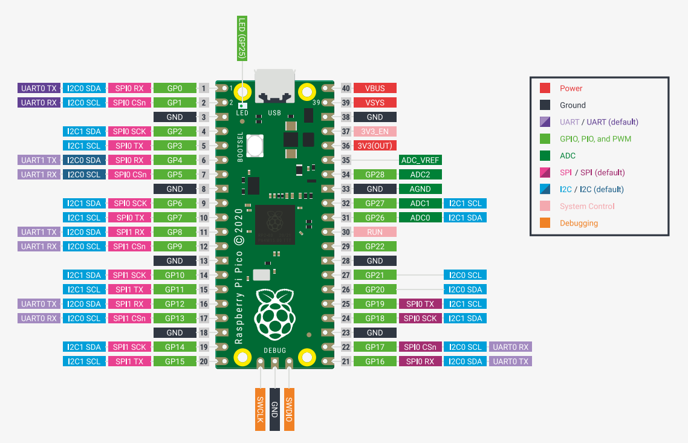

# Summer Intern 2024 Project

**Project Lead:** Jim Dratz

**Team Members:**
1. Kelvin Su
2. Chenyang Hu

## Introduction
This project utilizes two Python scripts, `main.py` and `applicationUpdated.py`.

- `main.py` is designed for use with the Raspberry Pi Pico microcontroller to manage data acquisition from multiple sensors through a series of multiplexers. It utilizes UART for serial communication with a host computer, I2C for interfacing with an MCP23017 I/O expander that controls 8 ADG732 multiplexers, and ADC for reading sensor data. The script supports dynamic control via stdin and stdout, allowing operations like pausing and resuming data collection.

- `applicationUpdated.py` serves as a GUI-based control and monitoring system for a Raspberry Pi Pico-based data acquisition setup. It allows users to start, pause, and resume data collection, set operational parameters like thresholds and cycle periods, and visualize the acquired data in real-time. Additionally, the application supports exporting collected data to Excel for further analysis.

- Essentially, what we are doing is biasing the ESD protection diode on each pin of an IC, and reading the voltage drop. If the IC is functional, we should get a voltage drop of ~0.6-0.7V, and that should be reflected in the data recorded. In the case of an open, the resistance should theoretically shoot up to infinity, in which case we would read near 0V. If that is ever read, our application will highlight it, indicating that an open has been detected

For more details on the actual project, you can refer to the Project Scope Document.docx.

## Prerequisites
- PC with a USB port
- Raspberry Pi Pico (Pinout can also be found within the repo, and at the bottom of this page)
- Micropython
- MCP23017 I/O Expander
- ADG732 Multiplexers (up to 8, each with 32 channels)
- Analog sensors compatible with the multiplexer setup
- Necessary wires and resistors for connections
- Breadboard or similar setup for prototyping
- VSC with a Python environment
- Libraries used in the program (e.g. PyQt5, pyserial, openpyxl, numpy)
- (Optional) Serial terminal software (e.g. Putty, Tera Term)

## Installations
- Connect each multiplexer's control pins to the specified GPIO pins on the Pico as per the `main.py` settings. (e.g. Connect the MCP23017 to the Raspberry Pi Pico via I2C, SDA to Pin2, SCL to Pin3)
- The Raspberry Pi Pico 3V3OUT is used for providing power for ADG732 multiplexers as well as the MCP23017, and the external power supply is used for providing power for testing PCBs.
- **CS** (Chip Selecting) lines use 8 separate lines on the Pico (starting from GPIO8 to GPIO15), while **EN** (Enable) line and **WR** (Write) line are only 1 for each (GPIO20 is the **EN** line, and GPIO21 is the **WR** line). Back to the **CS** line, GPIO8 will be considered as "MUX 1", GPIO9 will be "MUX 2", and onwards to GPIO15 corresponding to MUX 8.
- Ensure the connection is at the same baud rate. (typically 115200)
- Ensure the Raspberry Pi Pico is connected via USB and that the correct COM port is selected in the application.
- For the MCP23017, connect its GPA0 to GPA4 lines to the selection pins on every MUX (A0-A4 on the ADG732). 
- On the ADG732, ground pin 23, **DO NOT GROUND PIN 24 ON THE ADG732 (The Vss Pin)**
- Every drain (output) pin on the ADG732 should go into ADC1 pin on the Pico (the same as Pin 32). There should also be a resistor going to ground as well for that ADC pin. The resistor value will need to be callibrated based on the voltage being supplied to each ESD diode. Note that the ADC's on the Pico have a limit of 3.3V.

## How to Run
1. First flash the MicroPython firmware onto the Pico. Press the BOOTSEL button and hold it while you connect the other end of the microUSB cable, and you should see a drive pop up on your computer. Download MicroPython from their official website (https://micropython.org/), and move the file to the drive. The device should disappear and reset, indicating that you did it correctly, in which case you should be able to unplug and plug it back in. This youtube link is helpful to setting up the Pico as well as part of the next step in installing the Micropico extension (https://www.youtube.com/watch?v=O6lkYTfcMEg)
2. Next setup a Python environment on Visual Studio Code, as well as the Micropico extension.
3. To put the main.py file onto the Pico, first open a terminal instance of Pico vREPL, and click "Pico Disconnected" to toggle the board connection (it should say Pico Connected after you click it). Next, press Ctrl+Shift+P, and first select the "Delete all files from board." After that, repeat, but this time select "Upload current file to Pico" while on `main.py`. To confirm if done successfuly, you can open a terminal instance of Pico vREPL, and run the following commands:
`import os`
`os.listdir()`
You should be able to see main.py.
4. Next disconnect the Pico, unplug and plug the microUSB again. We do this to open up the COM port to allow for serial communication. To find which COM port the Pico is connected to on the computer, Micropico has a way to do it (Select "List serial ports" after you do Ctrl+Shift+P) In another terminal, run "py applicationUpdated.py" to open up the GUI. Before running, select the right COM port that Micropico mentioned. You can also set a threshold voltage, anything recorded below that threshold will be highlighted yellow. The cycle period refers how long you want one cycle to be (a cycle includes the time to switch through all 256 channels, as well as the time for the mux to rest). The select mux/channels right now are only there for the plot tab.
5. Now to begin running the application, first click "Stop." This is because whenever the Pico is initially plugged into the computer, it will always just continuously run the main.py file, meaning by the time you click "Start," you could already be halfway through a cycle. After you hit "Stop," you can click the "Timestamp" header on the top to sort the table better, and then hit "Start." It is worth noting that when you first plug the Pico in and open the application, we have found that this sometimes doesn't work, in which case you need to repeat the "Stop" into "Start" process. From here on out, the application will simply record all the data that it is being received. If you ever wish to stop the program, you can click the "Stop" button, but from that point, you should hit "Resume" if you want to continue from where you paused. The "Start" button should only be clicked if you ever want to reset back to the beginning (Mux 1, Channel 1). More details on the controls can be found in the "Operational Controls" section below.

## Additional Notes
- Modify the script parameters such as `channel_period` in `main.py` based on the specific timing and performance requirements of your sensors and multiplexers. The unit of `channel_period` is *s*. (e.g. `channel_period` = 0.1 means a frequency of 10Hz)
- The `channel_period_value` in `applicationUpdated.py` is **NOT** the actual frequency. However, it should be corresponding to the `channel_period` in `main.py`, typically, half of it for convenience. Also, the unit for `channel_period_value` is *ms*. (e.g. if `channel_period` is 0.1 in `main.py`, then `channel_period_value` should be 50 in `applicationUpdated.py`)
- When connecting the Raspberry Pi Pico to the PC, make sure Pico is disconnected. Otherwise, thread blocking might occur.
- Power off the constant voltage source when connecting the Raspberry Pi Pico to the PC.
- The max voltage for Raspberry Pi Pico is 3.3V, so the constant voltage source should be no larger than 4V

## Operational Controls
- **Start**: Begins the data acquisition process and reset the reading to mux1 channel1. But actually you should only use this button when launching the project.
- **Resume**: Continues data acquisition from where it was paused.
- **Stop**: Temporarily halts the data acquisition, retaining the current state.
- **Clear**: Clear all the data displaying on the UI.
- **Set threshold**: Once set, the voltage below this value will be highlighted. Initially defaulted as *None*, so nothing will be highlighted if no value is set.
- **Set cycle period**: Default value is 60s.
- **COM ports**: Varies from different PCs. Not necessarily COM9.
- **Export to Excel**: Export collecting data to an Excel and preserved those highlighted parts.
- **Show below threshold**: Only show data below the set threshold. That is the highlighted ones.

## Potential Problems
1. The `check_for_pause()` function in `main.py` is not robust, changing them might cause unexpected errors or crashes. 
2. `start_update`, `resume_update` and `stop_update` functions in `applicationUpdate.py` are not robust, changing them might cause unexpected errors or crashes.
3. `START` command is used for reset the selection from mux1 channel1. But in the UI window, you should press `STOP` button before pressing `START` button to function properly, or it just behaves like `RESUME` button. (If `START` still doesn't behave properly after pressing `STOP`, try this process again)
4. When the program keeps receiving data for a long time (several hours) without stop, there might will be a short stuck when pressing `Stop` button.

## Future Plans
- Add code robustness, especially the serial communication part. 
- Add a way for the user to specify how fast the Raspberry Pi Pico should be switching through each channel.
- Have a way to name the individual mux and channel numbers (maybe have a column next to the "select channels" box that allows for this)
- Add time robustness. Though some problems don't happen at first, they happen after a while (try leaving the application running overnight and see if it slows down).
- Have a tab that shows essentially a "TLDR" of every single mux and channel that is being read. For example, this tab can be similar to an excel-like grid page with every channel, and if an open is detected, highlight the channel cell red, as well as a number next to it that indicates how many times it has been detected as open.
- Further stress tests

Raspberry Pi Pico Pinout Image:
